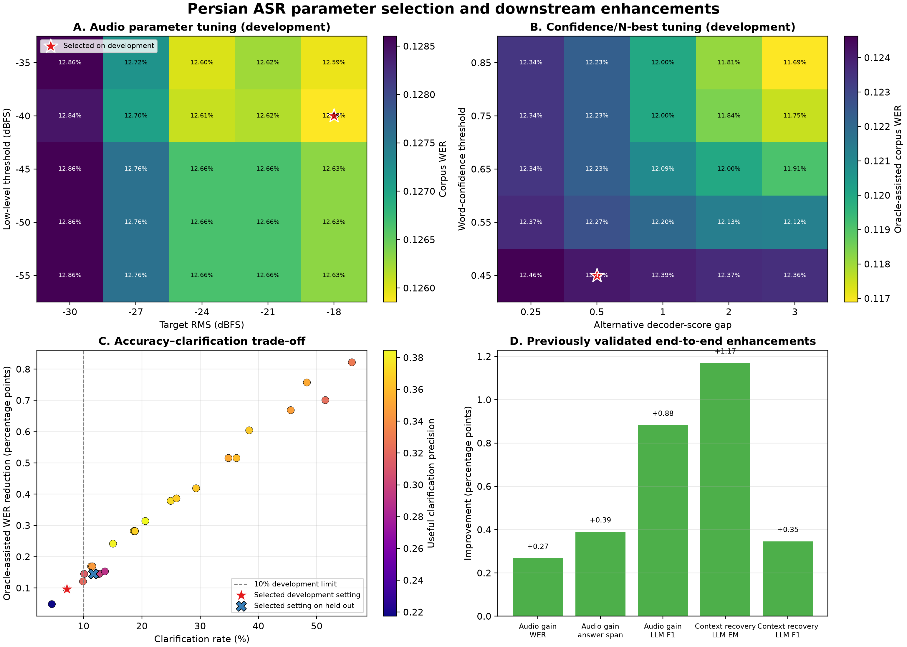

# ASR parameter-selection results

## Selected audio parameters

The 25-cell development grid selected a low-level threshold of
**-40 dBFS** and target RMS of
**-18 dBFS**, with maximum gain fixed at
40 dB and peak headroom fixed at -1 dBFS as safety constraints.

| Split | Baseline WER | Selected WER | WER change | Baseline answer span | Selected answer span |
|---|---:|---:|---:|---:|---:|
| Development (selection) | 12.868% | 12.585% | -0.283 pp | 67.70% | 68.28% |
| Held out (one frozen evaluation) | 12.482% | 11.992% | -0.490 pp | 62.30% | 63.49% |

The selected audio profile therefore reduced held-out WER by
0.490
percentage points and increased held-out answer-span preservation by
1.19
percentage points.

## Selected uncertainty parameters

Under the development limits of 10% total clarification and 5% unnecessary
clarification, the selected setting is confidence **0.45**
and decoder-score gap **0.5**.

| Setting/split | Corpus WER before | Oracle-assisted WER | Answer span before | Answer span after | Clarification | Unnecessary clarification |
|---|---:|---:|---:|---:|---:|---:|
| Existing 0.65/1.0, development | 12.511% | 12.092% | 68.12% | 70.69% | 29.31% | 18.61% |
| Selected, development | 12.511% | 12.414% | 68.12% | 68.51% | 7.13% | 4.75% |
| Selected, held out | 12.003% | 11.858% | 63.71% | 64.52% | 11.69% | 8.47% |

The confidence analysis uses 753
aligned recordings. 16
rows were excluded because a fresh primary pass did not exactly reproduce the
frozen transcript. Oracle-assisted metrics assume a user chooses the eligible
hypothesis that preserves the answer span and then minimizes WER. They measure
clarification potential, not autonomous ASR correction.

The held-out clarification rate exceeds the development limit, so 0.45/0.5 is
the best setting under the stated development rule but should not be described
as satisfying the operational constraint on unseen data.

